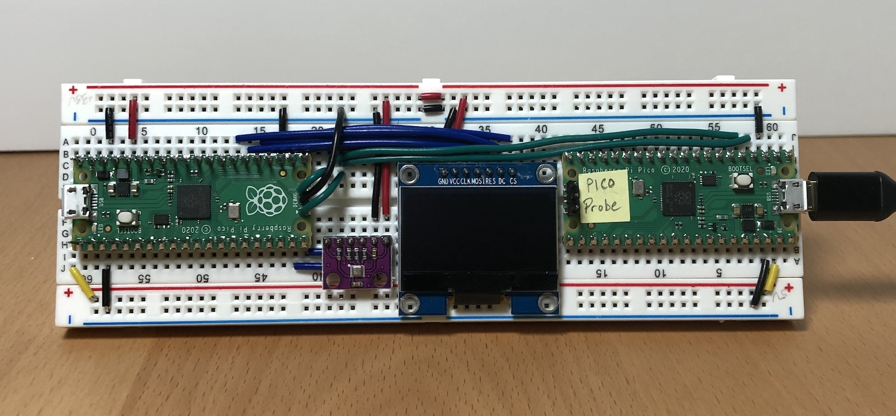

# Raspberry Pi Pico Projects

Example projects and setup for Raspberry Pi Pico development.


## Software Development Breadboard Setup

This breadboard setup simplifies basic development on the Pico by enabling program loading and debugging using the OpenGDB toolset with [PicoProbe](https://blog.smittytone.net/2021/02/05/how-to-debug-a-raspberry-pi-pico-with-a-mac-swd/).




### Board Build

TODO: Add schematic for breadboard here...

### Software Setup

The following instructions will use the C/C++ SDK and the OpenGDB toolset for Pico development running on MacOS.

**NOTE:** Much of this setup can be automated using the provided [pico_setup.sh](https://raw.githubusercontent.com/raspberrypi/pico-setup/master/pico_setup.sh) script but where is the fun in that?

1. These instructions require _homebrew_ and _git_ so install them if not already installed.

1. Open a terminal and create a directory for the tools and SDK.

	```
	$ mkdir ~/pico
	$ cd ~/pico
	```

1. Download and install the Pico SDK (git needs to be installed)

	```
	$ git clone -b master --recurse-submodules https://github.com/raspberrypi/pico-sdk.git ~/pico/pico-sdk
	```
	
	NOTE: This takes a while to run.

1. Add the SDK path to your environment.

	Open either `~/.bash_profile` or `~/.zshrc` using nano or any other editor.  (This will depend on the terminal shell being used.)
	
	Add the following lines to the end of the file, then save.
	
	```
	# Raspberry Pi Pico SDK Path
	export PICO_SDK_PATH="$HOME/pico/pico-sdk"
	```	
	
	NOTE: The terminal must be closed and a new terminal started for the changes to take effect.

1. Install the arm cross-compiler and cmake tools.

	```
	$ brew install cmake
	$ brew tap ArmMbed/homebrew-formulae
	$ brew install arm-none-eabi-gcc
	```
	
### Build a Test Project

Start a new project to verify the tools are setup properly.

1. Create a directory for the test project.

	```
	$ mkdir ~/pico/PicoTest
	$ cd ~/pico/PicoTest
	```
	
1. Copy the Pico-SDK CMake template into the new project.

	```
	$ cp ../pico-sdk/external/pico_sdk_import.cmake .
	```

1. Create a `CMakeLists.txt` file with the following configuration.

	```
	# What CMake to start at
	cmake_minimum_required(VERSION 3.12)
 
	# Include the subsidiary .cmake file to get the SDK
	include(pico_sdk_import.cmake)
 
	# Set the name and version of the project
	project(PicoTest VERSION 1.0.0)
 
	# Link the Project to a source file
	add_executable(PicoTest source.c)
 
	# Link the Project to an extra library (pico_stdlib)
	target_link_libraries(PicoTest pico_stdlib)
 
	# Initialize the SDK
	pico_sdk_init()
 
	# Enable both USB and UART output
	pico_enable_stdio_usb(PicoTest 1)
	pico_enable_stdio_uart(PicoTest 1)
 
	# Enable extra outputs (SWD?)
	pico_add_extra_outputs(PicoTest)
	```
	
1. Create a new header file `source.h` with the following lines:
	
	```
	#ifndef _PICOTEST_HEADER_
	#define _PICOTEST_HEADER_
	
	#include <stdio.h>
	#include "pico/stdlib.h"

	#endif // _PICOTEST_HEADER_
	```
	
1. Create a new source file `source.c` with the following lines:

	```
	#include "source.h"

	int main() {
		const uint LED_PIN = PICO_DEFAULT_LED_PIN;

    	gpio_init(LED_PIN);
    	gpio_set_dir(LED_PIN, GPIO_OUT);
	
		while (true) {
			gpio_put(LED_PIN, 1);
			sleep_ms(250);
			gpio_put(LED_PIN, 0);
			sleep_ms(250);
		}
	
		return 0;
	}
   ```
   
1. Create a build directory.

 	```
 	$ mkdir build
 	```

1. Build the project.

	```
	$ cd build
	$ cmake ..
	$ make
	```

### Load the Image on the Pico

There are two options to load the image using the **BOOTSEL** mode described below.  Use whichever method is more convenient.

#### File Manager File Copy

1. Put the Pico into **BOOTSEL** programming mode.

	1. If already connected, unplug the USB cable from the Pico board.
	
	1. Press and hold the **BOOTSEL** button while plugging the USB cable into the Pico.

	1. Release the **BOOTSEL** button.  

		The Pico should appear as a drive device on the computer.

1. Open a file manager window to the build directory.

	**TIP:** Open a file manager window for the current directory using the following command:
	
	```
	$ open .
	```

1. Copy the `PicoTest.uf2` file to the connected Pico device using the file manager to drag-and-drop the file.

The Pico will reboot (the drive will disconnect when this happens) and the new program will start running.

#### PicoTool Command-line Utility

1. Download and build PicoTool (if not already done).

	```
	$ git clone -b master https://github.com/raspberrypi/picotool.git ~/pico/picotool
	$ mkdir ~/pico/picotool/build
	$ cd ~/pico/picotool/build
	$ cmake ..
	$ make -j4
	$ sudo cp picotool /usr/local/bin/
	```

1. Follow the first step in the previous section to put the Pico into **BOOTSEL** mode.

1. Load the PicoTest image.

	```
	$ cd ~/pico/PicoTest/build
	$ picotool load -v -x PicoTest.uf2
	```

	The Pico should reboot and run the program.
	

### SWD Programming via PicoProbe

#### PicoProbe Setup

1. Download and build PicoProbe.

	```
	$ git clone https://github.com/raspberrypi/picoprobe.git ~/pico/picoprobe
	$ mkdir ~/pico/picoprobe/build
	$ cd ~/pico/picoprobe/build
	$ cmake ..
	$ make -j4
	```

1. Press and hold the **BOOTSEL** button while plugging the USB cable into the PicoProbe board.

	Release the **BOOTSEL** button and the Pico should appear as a drive device on the computer.

1. Copy the Pico Probe image, `picoprobe.uf2`, to the PicoProbe board (using either the file manager or the picotool).

1. The Pico will reboot into the PicoProbe program (the LED should be lit).


#### OpenOCD Setup

1. Install required packages for OpenOCD.

	```
	$ brew install libtool automake texinfo wget gcc pkg-config libusb
	$ export PATH="/usr/local/opt/texinfo/bin:$PATH"
	```
	
	NOTE: There may be errors if older packages are already installed.  Run `brew upgrade` for those packages.
	
	NOTE: If the _Apple Command Line Tools_ are missing then run `xcode-select --install` but this may take a very long time.

1. Download and build OpenOCD

	```
	$ git clone https://github.com/raspberrypi/openocd.git --branch picoprobe --depth=1 ~/pico/openocd
	$ cd ~/pico/openocd
	$ ./bootstrap
	$ ./configure --enable-picoprobe --disable-werror
	$ make -j4
	$ make install
	```	

1. Load the PicoTest program on the target board.

	```
	$ cd ~/pico/PicoTest/build
	$ openocd -f interface/picoprobe.cfg -f target/rp2040.cfg -c "program PicoTest.elf verify reset exit"
	```

	NOTE: If the target board was in **BOOTSEL** mode (as new boards are) then the verify may error since the target was in an _"unknown state"_.  Power the board off then back on.  The program should be running now and reprogramming will no longer give the unknown state error.


### Visual Studio Code IDE Setup

The [Visual Studio Code IDE](https://code.visualstudio.com) can be setup for Pico development, image programming and debugging.

1. A few modifications to the PicoTest project are needed before starting VSCode.

	```
	$ cd ~/pico/PicoTest
	$ rm -rf build
	$ mkdir .vscode
	```
	
1. Create a file named `.vscode/launch.json` and copy the following configuration:

	```
	{
	    "version": "0.2.0",
	    "configurations": [
	        {
	            "name": "Pico Debug",
	            "cwd": "${workspaceRoot}",
	            "executable": "${command:cmake.launchTargetPath}",
	            "request": "launch",
	            "type": "cortex-debug",
	            "servertype": "openocd",
	            "gdbPath" : "arm-none-eabi-gdb",
	            "device": "RP2040",
	            "configFiles": [
	                "interface/picoprobe.cfg",
	                "target/rp2040.cfg"
	            ],                 
	            "svdFile": "${env:PICO_SDK_PATH}/src/rp2040/hardware_regs/rp2040.svd",
	            "runToMain": true,
	            "postRestartCommands": [
	                "break main",
	                "continue"
	            ]
	        }
	    ]
	}
	```
	
1. Create a file named `.vscode/settings.json` and copy the following configuration:

	```
	{
		"cmake.statusbar.advanced": {
			"debug": {
				"visibility": "hidden"
			},
			"launch": {
				"visibility": "hidden"
			},
			"build": {
				"visibility": "hidden"
			},
			"buildTarget": {
				"visibility": "hidden"
			}
		},
		"cmake.buildBeforeRun": true,
		"C_Cpp.default.configurationProvider": "ms-vscode.cmake-tools"
	}
	```


1. Start Visual Studio Code ([download](https://code.visualstudio.com/Download) and install if necessary).

1. Add CMake support to Visual Studio Code.
		
	1. Click on the Extensions icon (on the left side bar).
	
	1. Enter `CMake Tools` in the search field.

	1. Locate _CMake Tools by Microsoft_ in the list and click **Install**.

1. Add the Cortex-Debug extension.

	1. Click on the Extensions icon (on the left side bar).

	1. Enter `cortex-debug` in the search field.

	1. Locate _Cortex-Debug_ in the list and click **Install**.
	

1. Open the PicoTest folder.

	NOTE: Remove the build directory if built with the command line tools to avoid conflicts.
	
	CMake will ask to select a kit.  Click "Scan for Kits".  On the bottom status bar, click the kit icon.  Pick "GCC 9.2.1 arm-none-eabi" (or whatever the current version of the arm tools are).

1. The CMake build will automatically run.  Check for errors in the message window.	
1. Click the "Run" button on the left-hand side to launch the debugger.

1. There will be a small green arrow labeled Pico Debug at the top of the window on the left.  Click the green arrow to load and run the program.


### Automated Pico Project Generator

So that was all fun and stuff but it will be faster to use this automated project generator script to create new projects going forward.

```
$ wget https://raw.githubusercontent.com/smittytone/pi-pico/main/makepico/makepico.zsh
$ sudo cp makepico.zsh /usr/local/bin
```

Use the `-d` option to create a project with PicoProbe debugging enabled.

```
$ makepico.zsh ~/pico/PicoAutoProjectTest -d
```


### Other Pico GitHub Repositories

These repositories ([pico-examples](https://github.com/raspberrypi/pico-examples), [pico-extras](https://github.com/raspberrypi/pico-extras), [pico-playground](https://github.com/raspberrypi/pico-playground)) have additional examples and tools so clone them if needed.

```
$ git clone -b master https://github.com/raspberrypi/pico-examples.git ~/pico/pico-examples
$ git clone -b master https://github.com/raspberrypi/pico-extras.git ~/pico/pico-extras
$ git clone -b master https://github.com/raspberrypi/pico-playground.git ~/pico/pico-playground
```

Add path environment variable exports to either `~/.bash_profile` or `~/.zshrc`.

``` 
export PICO_EXAMPLES_PATH="$HOME/pico/pico-examples"
export PICO_EXTRAS_PATH="$HOME/pico/pico-extras"
export PICO_PLAYGROUND_PATH="$HOME/pico/pico-playground"
```


### Pico-SDK Updates

The Git repository simplifies updating the Pico-SDK to a single `git pull` but there is an extra step (`git submodule update`) due to the nested submodules so remember to run both of the following steps when updating, otherwise weird errors may occur due to out-of-sync software.

```
$ cd ~/pico/pico-sdk
$ git pull
$ git submodule update
```


### References

* [How to program the Raspberry Pi Pico in C on a Mac](https://blog.smittytone.net/2021/02/02/program-raspberry-pi-pico-c-mac/)
* [How to debug a Raspberry Pi Pico with a Mac, SWD and another Pico](https://blog.smittytone.net/2021/02/05/how-to-debug-a-raspberry-pi-pico-with-a-mac-swd/)
* [GitHub:smittytone/pi-pico](https://github.com/smittytone/pi-pico)
* [Getting started with Raspberry Pi Pico](https://datasheets.raspberrypi.org/pico/getting-started-with-pico.pdf)
* [GitHub:raspberrypi/pico-examples](https://github.com/raspberrypi/pico-examples)

